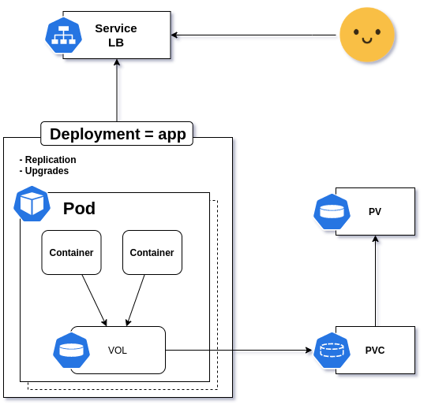
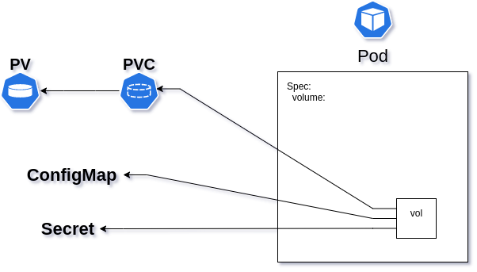
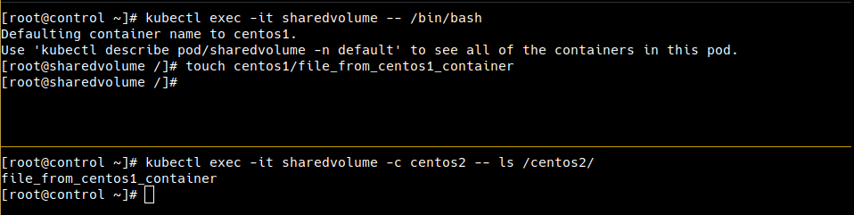

Certified Kubernetes Administrator (CKA)
========================================

Table of Contents
=================
- [Preparing Hosts](#preparing-hosts)
- [Install Kubernetes](#install-kubernetes)
  - [Simple Cluster](#simple-cluster)
- [Understanding API Access and Commands](#understanding-api-access-and-commands)
  - [Options for Accessing the API](#options-for-accessing-the-api)
  - [Using kubectl](#using-kubectl)
    - [enable autocompletion](#enable-autocompletions)
  - [Accessing APIs Using curl](#accessing-apis-using-curl)
  - [Understanfing etcdctl](#understanding-etcdctl)
- [Running Pods by Using Deployments](#)
  - [Understanding Namespaces](#understanding-namespaces)
  - [Exploring Default Namespaces](#exploring-default-namespaces)
  - [Creating Custom Namespaces](#creating-custom-namespaces)
  - [Managing Pods and Deployments](#managing-pods-and-deployments)
    - [Easy way to get YAML file example](#easy-way-to-get-yaml-file-example)
    - [Managing Deployment Scalability](#managing-deployment-scalability)
  - [Labels](#labels)
    - [Deleting Labels](#deleting-labels)
  - [Rolling Updates](#rolling-updates)
  - [Understanding Init Containers](#understanding-init-containers)
  - [Understanding StatefulSets](#understanding-statefulset)
    - [StatefilSets Limitations](#statefulset-limitations)
  - [Using DaemonSets](#using-daemonsets)
- [Managing Storage](#managing-storage)

## Preparing Hosts

1. disable firewalld
2. disable selinux
3. disable swap
4. install docker
    ```bash
    yum install -y vim yum-utils device-mapper-persistent-data lvm2
    yum-config-manager --add-repo https://download.docker.com/linux/centos/docker-ce.repo
    yum install -y docker-ce
    cat > /etc/docker/daemon.json <<EOF
    {
      "exec-opts": ["native.cgroupdriver=systemd"],
      "log-driver": "json-file",
      "log-opts": {
        "max-size": "100m"
      },
      "storage-driver": "overlay2",
      "storage-opts": [
        "overlay2.override_kernel_check=true"
      ]
    }
    EOF
    mkdir -p /etc/systemd/system/docker.service.d
    systemctl daemon-reload
    systemctl restart docker
    systemctl enable docker
    ``` 
5. configure /etc/hosts
    ```bash
    cat >> /etc/hosts << EOF 
    {
      10.10.10.1 control.example.com control
      10.10.10.2 worker1.example.com worker1
      10.10.10.3 worker2.example.com worker2
      10.10.10.4 worker3.example.com worker3
    }
    EOF
    ```
6. install kube tools
    ```bash
    cat <<EOF > /etc/yum.repos.d/kubernetes.repo
    [kubernetes]
    name=Kubernetes
    baseurl=https://packages.cloud.google.com/yum/repos/kubernetes-el7-x86_64
    enabled=1
    gpgcheck=1
    repo_gpgcheck=1
    gpgkey=https://packages.cloud.google.com/yum/doc/yum-key.gpg https://packages.cloud.google.com/yum/doc/rpm-package-key.gpg
    EOF

    yum install -y kubelet kubeadm kubectl --disableexcludes=kubernetes
    systemctl enable --now kubelet
    ```
7. configure sysctl
    ```bash
    cat <<EOF >  /etc/sysctl.d/k8s.conf
    net.bridge.bridge-nf-call-ip6tables = 1
    net.bridge.bridge-nf-call-iptables = 1
    EOF
    sysctl --system
    ```
# Install Kubernetes

### Simple Cluster
on the control node run kubeadm
```bash
kubeadm init --pod-network-cidr=192.168.0.0/16
```
в выводе команды будет инструкция для подключения сохраняем на всякий случай
настраиваем  для нужного пользователя подключение
затем устанавливаем нетворк аддон в моём случае calico
```bash
curl https://docs.projectcalico.org/manifests/calico.yaml -O
kubectl apply -f calico.yaml
[admin@control ~]$ kubectl get pods -n kube-system 
NAME                                     READY   STATUS    RESTARTS   AGE
calico-kube-controllers-7d569d95-qxsdl   1/1     Running   0          6m1s
calico-node-nn24x                        1/1     Running   0          6m1s
coredns-f9fd979d6-4f2k5                  1/1     Running   0          14m
coredns-f9fd979d6-54s7x                  1/1     Running   0          14m
etcd-control                             1/1     Running   0          14m
kube-apiserver-control                   1/1     Running   0          14m
kube-controller-manager-control          1/1     Running   0          14m
kube-proxy-5dqhh                         1/1     Running   0          14m
kube-scheduler-control                   1/1     Running   0          14m
```
waiting for calico running

затем заходим на воркеры и джойним их к мастеру используя последнюю команду kubeadm join из вывода kubeadm init
```bash
[root@worker1 ~]# kubeadm join 1.2.3.4:6443 --token ipb559.1ketsik9hzec4q5e \
    --discovery-token-ca-cert-hash sha256:7e6283511a5159ab1c389bedf32fd91b6ca764cb980587fdfc4403f924d4f5dc 
```
on the control node, check that the workers have joined:
```bash
[root@control ~]# kubectl get nodes
NAME      STATUS   ROLES    AGE   VERSION
control   Ready    master   39m   v1.19.3
worker1   Ready    <none>   18m   v1.19.3
worker2   Ready    <none>   15m   v1.19.3
worker3   Ready    <none>   15m   v1.19.3
```

повесить лейбл на ноду:
```bash
kubectl label nodes worker1 node-role.kubernetes.io/worker=worker
```
убрать лейбл с ноды:
```bash
kubectl label nodes worker1 node-role.kubernetes.io/worker-
```

# Understanding API Access and Commands



- API access is regulated by using RBAC (Role Based Access Control)
- In RBAC, user accounts are identified as a  set of certificates associated to a name, defined in **~/.kube/config**
- Use **kubectl auth can-i** to verify what you can do with current credentials
  - **kubectl auth can-i create deployments**
  - **kubectl auth can-i create pods --as user2**
  - **kubectl auth can-i create pods --as user2 --namespace prod**

## Options for Accessing the API
- **kubectl api-resources** will show API groups ads resources wuthin the APIs
- After running kubectl proxy, you can also curl to explore group information
  - **curl http://localhost:8001/apis**
- **kubectl api-versions** will show current API versions
- **kubectl explain** can be
  - **kubectl explain pod | less**
  - **kubectl explain pod.spec.containers**
 
## Using kubectl
- The **kubectl** command is the default command interface the API
- Use **kubectl cluster-info** as a first test od its working
- Current configuration is stored in **~/.kube/config**
- Use **kubectl config view** to view the current config
- Multi-cluster access is possoble, but a git complicared, see [link](https://kubernetes.io/docs/tasks/access-application-cluster/configure-access-multiple-clusters/)

### enable autocompletion:
- install **bash-completion** 
- enable **kubectl completion bash** using **kubectl completion bash > /etc/bash_completion.d/kubectl**
- or configure **~/.bashrc** file using **source <(kubectl completion bash)**
- or **kubectl completion bash >> ~/.bashrc**

## Accessing APIs Using **curl**
- The APIs are RESTful, which means they respond to typical HTTP requests cush as GET, POST and DELETE
- This makes it easy to interact with other systems
- If the appropriate certificates are used, the API can be addressed derectly using **curl**
  - **curl --cert myuser.pem --key myuser-key.pem --cacert /root/myca.pem https://controller:6443/api/v1**
- To make API access easy without using certificates, **kubectl proxy** can be used
  - **kubectl proxy --port=8001 &**
  - **curl http://localhost:8001**
for example:
```bash
[root@control ~]# kubectl proxy --port=8001 &
[1] 2643
[root@control ~]# Starting to serve on 127.0.0.1:8001

[root@control ~]# curl -XGET http://localhost:8001/version
{
  "major": "1",
  "minor": "19",
  "gitVersion": "v1.19.3",
  "gitCommit": "1e11e4a2108024935ecfcb2912226cedeafd99df",
  "gitTreeState": "clean",
  "buildDate": "2020-10-14T12:41:49Z",
  "goVersion": "go1.15.2",
  "compiler": "gc",
  "platform": "linux/amd64"
}[root@control ~]#
[root@control ~]# curl -XGET http://localhost:8001/api/v1/namespaces/default/pods
...

[root@control ~]# curl -XDELETE http://localhost:8001/api/v1/namespaces/default/pods/mynginx
[root@control ~]#kubectl get pods
NAME                       READY   STATUS              RESTARTS   AGE
mynginx                    0/1     Terminating         0          5h6m
```

### Understanding etcdctl
- The etcdctl command can be used to interrogate and manage the etcd database
- Different versions of the command exist: etcdctl2 is to interact with v2 of the API, and etcdctl version independent

```bash
yum install -y etcd
etcdctl -h
ETCDCTL_API=3 etcdctl -h
```
 
# Running Pods by Using Deployments
## Understanding Namespaces
- Namespaces are a Linux kernel feature that is leveraged up to Kubernetes level
- Namespaces implement strict resource separation
- Resource limitation through quota can be implemented at a Namespace level also
- Use namespaces to separate different customer environments within one Kubernetes cluster

## Exploring Default Namespaces
Four namespaces are defined when a cluster is created
- default: this is where all Kubernetes resources are created by default
- kube-nodelease: an administrative namespace where node lease information is stored - may be empty and/or non-existing
- kube-public: a namespace that is world-readable. Generic information can be stored here, but it's often empty
- kube-system: contains all infrastructure pods

## Creating Custom Namespaces
- Namespaces can be created usinf YAML files, or from the command line
- **kubectl get ns**
- **kubectl get all --all-namespaces**
- **kubectl create ns dev**
- **kubectl describe ns dev**
- **kubectl get ns dev -o yaml**

## Managing Pods and Deployments
```bash
kubectl create deployment --image=nginx nginx1
kubectl get all
[root@control ~]# kubectl get all
NAME                         READY   STATUS    RESTARTS   AGE
pod/nginx1-b97c459f7-n6m7h   1/1     Running   0          15s

NAME                 TYPE        CLUSTER-IP   EXTERNAL-IP   PORT(S)   AGE
service/kubernetes   ClusterIP   10.96.0.1    <none>        443/TCP   6h46m

NAME                     READY   UP-TO-DATE   AVAILABLE   AGE
deployment.apps/nginx1   1/1     1            1           15s

NAME                               DESIRED   CURRENT   READY   AGE
replicaset.apps/nginx1-b97c459f7   1         1         1       15s
```
### Easy way to get YAML file example
```bash
kubectl create deployment --dry-run --image=nginx nginx0 -o yaml > deployment-example.yaml
```
### Managing Deployment Scalability
```bash
[root@control ~]# kubectl get deployments.apps
NAME     READY   UP-TO-DATE   AVAILABLE   AGE
nginx1   1/1     1            1           42m
[root@control ~]# kubectl scale deployment nginx1 --replicas=3
deployment.apps/nginx1 scaled
[root@control ~]# kubectl get deployments.apps
NAME     READY   UP-TO-DATE   AVAILABLE   AGE
nginx1   2/3     3            2           43m
[root@control ~]# kubectl get pods
NAME                     READY   STATUS    RESTARTS   AGE
nginx1-b97c459f7-lc8gk   1/1     Running   0          18s
nginx1-b97c459f7-n6m7h   1/1     Running   0          43m
nginx1-b97c459f7-xsbnf   1/1     Running   0          18s
```
OR use
```bash
kubectl edit deployments.apps nginx1
```

## Labels 
```bash
[root@control ~]# kubectl get all --show-labels 
NAME                         READY   STATUS    RESTARTS   AGE    LABELS
pod/nginx1-b97c459f7-lc8gk   1/1     Running   0          6m1s   app=nginx1,pod-template-hash=b97c459f7
pod/nginx1-b97c459f7-n6m7h   1/1     Running   0          49m    app=nginx1,pod-template-hash=b97c459f7
pod/nginx1-b97c459f7-xsbnf   1/1     Running   0          6m1s   app=nginx1,pod-template-hash=b97c459f7

NAME                 TYPE        CLUSTER-IP   EXTERNAL-IP   PORT(S)   AGE     LABELS
service/kubernetes   ClusterIP   10.96.0.1    <none>        443/TCP   7h36m   component=apiserver,provider=kubernetes

NAME                     READY   UP-TO-DATE   AVAILABLE   AGE   LABELS
deployment.apps/nginx1   3/3     3            3           49m   app=nginx1

NAME                               DESIRED   CURRENT   READY   AGE   LABELS
replicaset.apps/nginx1-b97c459f7   3         3         3       49m   app=nginx1,pod-template-hash=b97c459f7
[root@control ~]# kubectl get all --selector app=nginx1
NAME                         READY   STATUS    RESTARTS   AGE
pod/nginx1-b97c459f7-lc8gk   1/1     Running   0          20m
pod/nginx1-b97c459f7-n6m7h   1/1     Running   0          64m
pod/nginx1-b97c459f7-xsbnf   1/1     Running   0          20m

NAME                     READY   UP-TO-DATE   AVAILABLE   AGE
deployment.apps/nginx1   3/3     3            3           64m

NAME                               DESIRED   CURRENT   READY   AGE
replicaset.apps/nginx1-b97c459f7   3         3         3       64m
```
### Deleting Labels
```bash
[root@control ~]# kubectl get pods
NAME                     READY   STATUS    RESTARTS   AGE
nginx1-b97c459f7-lc8gk   1/1     Running   0          31m
nginx1-b97c459f7-n6m7h   1/1     Running   0          74m
nginx1-b97c459f7-xsbnf   1/1     Running   0          31m
[root@control ~]# kubectl get pods --show-labels
NAME                     READY   STATUS    RESTARTS   AGE   LABELS
nginx1-b97c459f7-lc8gk   1/1     Running   0          33m   app=nginx1,pod-template-hash=b97c459f7
nginx1-b97c459f7-n6m7h   1/1     Running   0          76m   app=nginx1,pod-template-hash=b97c459f7
nginx1-b97c459f7-xsbnf   1/1     Running   0          33m   app=nginx1,pod-template-hash=b97c459f7
[root@control ~]# kubectl label pod nginx1-b97c459f7-lc8gk app-; kubectl get pods
pod/nginx1-b97c459f7-lc8gk labeled
NAME                     READY   STATUS              RESTARTS   AGE
nginx1-b97c459f7-gmr7f   0/1     ContainerCreating   0          0s
nginx1-b97c459f7-lc8gk   1/1     Running             0          34m
nginx1-b97c459f7-n6m7h   1/1     Running             0          77m
nginx1-b97c459f7-xsbnf   1/1     Running             0          34m
```
New Pod was created becouse Deployment tracks labels too


## Rolling Updates

```yaml
apiVersion: apps/v1
kind: Deployment
metadata:
  name: nginx-deployment
  labels:
    app: nginx
spec:
  replicas: 3
  selector:
    matchLabels:
      app: nginx
  template:
    metadata:
      labels:
        app: nginx
    spec:
      containers:
      - name: nginx
        image: nginx:1.14.2
        ports:
        - containerPort: 80
```

Deployment ensures that only a certain number of Pods are down while they are being updated. By default, it ensures that at least 75% of the desired number of Pods are up (25% max unavailable).

Deployment also ensures that only a certain number of Pods are created above the desired number of Pods. By default, it ensures that at most 125% of the desired number of Pods are up (25% max surge).

For Example:
```yaml
apiVersion: apps/v1
kind: Deployment
metadata:
  name: rolling-nginx
spec:
  replicas: 4
  strategy:
    type: RollingUpdate
    rollingUpdate:
      maxSurge: 2
      maxUnavailable: 1
  selector:
    matchLabels:
      app: nginx
  template:
    metadata:
      name: nginx
      labels:
        app: nginx
    spec:
      containers:
      - name: nginx
        image: nginx:1.8
```
```bash
[root@control ~]# kubectl apply -y rollin.yaml
deployment.apps/rolling-nginx created
[root@control ~]# kubectl rollout history deployment rolling-nginx 
deployment.apps/rolling-nginx 
REVISION  CHANGE-CAUSE
1         <none>
```
then change ...containers.image  version
```bash
kubectl edit deployments rolling-ngine
deployment.apps/rolling-nginx edited
kubectl get replicasets.apps
NAME                       DESIRED   CURRENT   READY   AGE
rolling-nginx-7547488759   4         4         4       119s
rolling-nginx-7794bdf7b5   0         0         0       7m9s

kubectl rollout history deployment rolling-nginx --revision=2
deployment.apps/rolling-nginx with revision #2
Pod Template:
  Labels:       app=nginx
        pod-template-hash=7547488759
  Containers:
   nginx:
    Image:      nginx:1.15
    Port:       <none>
    Host Port:  <none>
    Environment:        <none>
    Mounts:     <none>
  Volumes:      <none>

kubectl rollout history deployment rolling-nginx --revision=1
deployment.apps/rolling-nginx with revision #1
Pod Template:
  Labels:       app=nginx
        pod-template-hash=7794bdf7b5
  Containers:
   nginx:
    Image:      nginx:1.8
    Port:       <none>
    Host Port:  <none>
    Environment:        <none>
    Mounts:     <none>
  Volumes:      <none>

kubectl rollout undo deployment rolling-nginx --to-revision=1
deployment.apps/rolling-nginx rolled back
```

## Understanding Init Containers

- If a Pod has 2 containers, one of them can be used as an init container. An init container can be used to prepare something and this will be done before the main application is started
- Init containers will always run to completion, and only after it has completed successfully, will the next container start
- Init containers are defined using the initContainers filed in the Pod spec

for example:
```yaml
apiVersion: v1
kind: Pod
metadata: 
  name: initpod
spec:
  containers:
  - name: after-init
    image: busybox
    command: ['sh', '-c', 'echo its running! && sleep 3600'] 
  initContainers:
  - name: init-myservice
    image: busybox
    command: ['sh', '-c', 'until nslookup myservice; do echo waiting for myservice; sleep 2; done;'] 


[root@control ~]# kubectl apply init-example.yaml
pod/initpod created
[root@control ~]# kubectl get pods
NAME                     READY   STATUS     RESTARTS   AGE
initpod                  0/1     Init:0/1   0          36s

[root@control ~]# kubectl expose deployment nginx --port=80 --name=myservice
[root@control ~]# kubectl get pods
NAME                     READY   STATUS    RESTARTS   AGE
initpod                  1/1     Running   0          7m59s
nginx-6799fc88d8-s5428   1/1     Running   0          56s
```

## Understanding StatefulSets

- StatefulSets are line deployments, but provide guarantees about the ordering and uniqueness of Pods
- StatefulSet maintains a unique identity for each Pod, which makes it so Pods are not interchangeable
- StatefulSets are valuable if the application has one of the following requirements
  - unique network identifiers
  - stable persistent storage
  - ordered deployment and scaling
  - ordered automated rolling updates
- [documentation link](https://kubernetes.io/docs/concepts/workloads/controllers/statefulset/)

### StatefilSets Limitations

StatefulSets have a number of limitations, and for that reason should only be used if their features are specifically required
- Storage must be provisioned by a PersistentVolume
- Deleting a StatefulSet will not delete associated storage
- A Headless Service is required to provide network identity for Pods in a StatefulSet
- To ensure Pods in a StatefulSet are terminated properly, the number of Pods should be scaled down to 0 before deleting the StatefulSet


### Example
```yaml
apiVersion: v1
kind: Service
metadata:
  name: nginx
  labels:
    app: nginx
spec:
  ports:
  - port: 80
    name: web
  clusterIP: None
  selector:
    app: nginx
---
apiVersion: apps/v1
kind: StatefulSet
metadata:
  name: web
spec:
  selector:
    matchLabels:
      app: nginx # has to match .spec.template.metadata.labels
  serviceName: "nginx"
  replicas: 3 # by default is 1
  template:
    metadata:
      labels:
        app: nginx # has to match .spec.selector.matchLabels
    spec:
      terminationGracePeriodSeconds: 10
      containers:
      - name: nginx
        image: k8s.gcr.io/nginx-slim:0.8
        ports:
        - containerPort: 80
          name: web
        volumeMounts:
        - name: www
          mountPath: /usr/share/nginx/html
  volumeClaimTemplates:
  - metadata:
      name: www
    spec:
      accessModes: [ "ReadWriteOnce" ]
      storageClassName: "my-storage-class"
      resources:
        requests:
          storage: 1Gi
```

## Using DaemonSets

- A DaemonSet ensures that all or some nodes run a copy of Pod
- Daemonsets are useful for services that should be running everywhere
- As nodes are added to the cluster, Pods are added to them automatically by the DaemonSet
- Deleting a DaemonSet will delete the Pods it created
- DaemonSets are used in specific cases
  - Running cluster storage daemon such as ceph or glusterd on each node
  - Running log collecgion daemons on every node
  - Running monitoring daemons such as collectd, Prometheus Node Exporter and others on each node


example:
```yaml
apiVersion: apps/v1
kind: DaemonSet
metadata:
  name: fluentd-elasticsearch
  namespace: kube-system
  labels:
    k8s-app: fluentd-logging
spec:
  selector:
    matchLabels:
      name: fluentd-elasticsearch
  template:
    metadata:
      labels:
        name: fluentd-elasticsearch
    spec:
      tolerations:
      - key: node-role.kubernetes.io/master
        effect: NoSchedule
      containers:
      - name: fluentd-elasticsearch
        image: quay.io/fluentd_elasticsearch/fluentd:v2.5.2
        resources:
          limits:
            memory: 200Mi
          requests:
            cpu: 100m
            memory: 200Mi
        volumeMounts:
        - name: varlog
          mountPath: /var/log
        - name: varlibdockercontainers
          mountPath: /var/lib/docker/containers
          readOnly: true
      terminationGracePeriodSeconds: 30
      volumes:
      - name: varlog
        hostPath:
          path: /var/log
      - name: varlibdockercontainers
        hostPath:
          path: /var/lib/docker/containers
```

```bash
[root@control ~]# kubectl apply -f daemonset-fluentd.yaml
daemonset.apps/fluentd-elasticsearch created
[root@control ~]# kubectl get daemonsets.apps -n kube-system
NAME                    DESIRED   CURRENT   READY   UP-TO-DATE   AVAILABLE   NODE SELECTOR            AGE
calico-node             4         4         4       4            4           kubernetes.io/os=linux   24h
fluentd-elasticsearch   4         4         4       4            4           <none>                   35s
kube-proxy              4         4         4       4            4           kubernetes.io/os=linux   24h
[root@control ~]# kubectl get pods -n kube-system  | grep elastic
fluentd-elasticsearch-4cx76              1/1     Running   0          2m2s
fluentd-elasticsearch-7b7dp              1/1     Running   0          2m2s
fluentd-elasticsearch-g5nb7              1/1     Running   0          2m2s
fluentd-elasticsearch-r49hf              1/1     Running   0          2m2s

```

### task: run a pod on each worker
```yaml
apiVersion: apps/v1
kind: DaemonSet
metadata:
  name: nginx-everynode
  labels:
    k8s-app: nginx-every
spec:
  selector:
    matchLabels:
      name: nginx-everynode
  template:
    metadata:
      labels:
        name: nginx-everynode
    spec:
      containers:
      - name: nginx-everynode
        image: nginx
```

```bash
[root@control ~]# kubectl apply -f daemonset-example.yaml
daemonset.apps/nginx-everynode created
[root@control ~]# kubectl get pods --selector name=nginx-everynode -o wide
NAME                    READY   STATUS    RESTARTS   AGE     IP                NODE      NOMINATED NODE
READINESS GATES
nginx-everynode-4q5bj   1/1     Running   0          2m14s   192.168.182.10    worker3   <none>
<none>
nginx-everynode-cngpt   1/1     Running   0          2m14s   192.168.189.72    worker2   <none>
<none>
nginx-everynode-nzsj2   1/1     Running   0          2m14s   192.168.235.136   worker1   <none>
<none>

```

## Managing Storage



```yaml
apiVersion: v1
kind: Pod
metadata:
  name: sharedvolume
spec:
  containers:
  - name: centos1
    image: centos:7
    command:
      - sleep
      - "3600"
    volumeMounts:
      - mountPath: /centos1
        name: test
  - name: centos2
    image: centos:7
    command:
      - sleep
      - "3600"
    volumeMounts:
      - mountPath: /centos2
        name: test
  volumes:
    - name: test
      emptyDir: {}
```

```bash
[root@control ~]# kubectl apply -f shared-volume.yaml
pod/sharedvolume created
```
see more `kubectl explain pod.spec.volumes`




## Configuring PV Storage

pv.yaml
```yaml
kind: PersistentVolume
apiVersion: v1
metadata:
  name: pv-volume
  labels:
    type: local
spec:
  capacity:
    storage: 2Gi
  accessModes:
    - ReadWriteOnce
  hostPath:
    path: '/mydata'
```
```bash
[root@control ~]# kubectl apply -f pv.yaml
persistentvolume/pv-volume created
[root@control ~]# kubectl get pv
NAME        CAPACITY   ACCESS MODES   RECLAIM POLICY   STATUS      CLAIM   STORAGECLASS   REASON   AGE
pv-volume   2Gi        RWO            Retain           Available                                   48s

```
```yaml
apiVersion: v1
kind: PersistentVolume
metadata:
  name: pv-nfs
  labels:
    type: nfs
spec:
  capacity:
    storage: 1Gi
  accessModes:
    - ReadWriteMany
  persistentVolumeReclaimPolicy: Retain
  nfs:
    path: /data
    server: myserver
    readOnly: false
```

