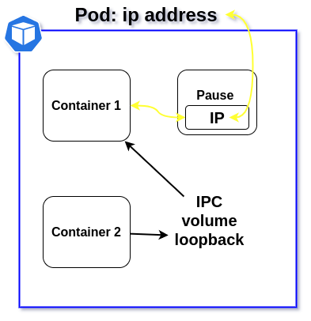
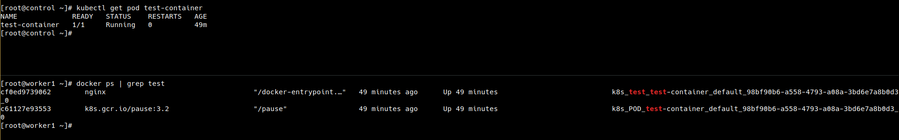
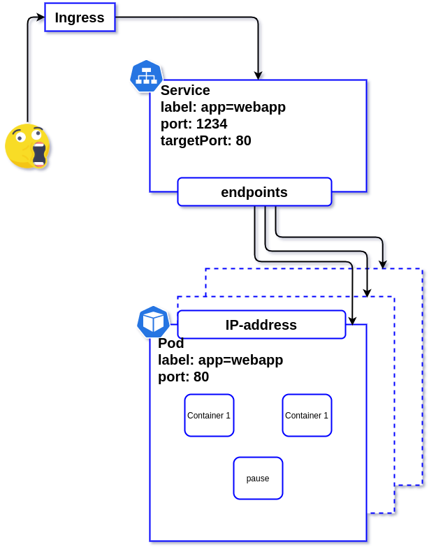
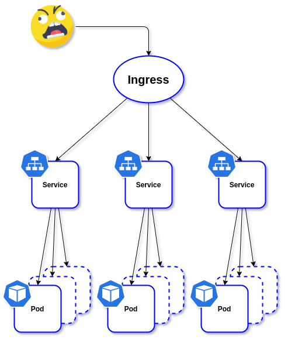

Certified Kubernetes Administrator (CKA)
========================================

Table of Contents
=================
- [Preparing Hosts](#preparing-hosts)
- [Install Kubernetes](#install-kubernetes)
  - [Simple Cluster](#simple-cluster)
  - [Joining your nodes](#joining-your-nodes)
- [Ingress Controller](#ingress-controller)
  - [Installation with Manifests](#installation-with-manifests)
    - [Configure RBAC](#configure-rbac)
    - [Create Common Resources](#create-common-resources)
    - [Create Custom Resources](#create-custom-resources)
  - [Deploy the Ingress Controller](#deploy-the-ingress-controller)
    - [Run the Ingress Controller](#run-the-ingress-controller)
    - [Check that the Ingress Controller is Running](#check-that-the-ingess-controller-is-running)
  - [Get Access to the Ingress Controller](#get-access-to-the-ingress-controller)
    - [Create a Service for the Ingress Controller Pods](#create-a-service-for-the-ingress-controller-pods)
  - [Uninstall the Ingress Controller](#uninstall-the-ingress)
- [Understanding API Access and Commands](#understanding-api-access-and-commands)
  - [Options for Accessing the API](#options-for-accessing-the-api)
  - [Using kubectl](#using-kubectl)
    - [enable autocompletion](#enable-autocompletions)
  - [Accessing APIs Using curl](#accessing-apis-using-curl)
  - [Understanfing etcdctl](#understanding-etcdctl)
- [Running Pods by Using Deployments](#)
  - [Understanding Namespaces](#understanding-namespaces)
  - [Exploring Default Namespaces](#exploring-default-namespaces)
  - [Creating Custom Namespaces](#creating-custom-namespaces)
  - [Managing Pods and Deployments](#managing-pods-and-deployments)
    - [Easy way to get YAML file example](#easy-way-to-get-yaml-file-example)
    - [Managing Deployment Scalability](#managing-deployment-scalability)
  - [Labels](#labels)
    - [Deleting Labels](#deleting-labels)
  - [Rolling Updates](#rolling-updates)
  - [Understanding Init Containers](#understanding-init-containers)
  - [Understanding StatefulSets](#understanding-statefulset)
    - [StatefilSets Limitations](#statefulset-limitations)
  - [Using DaemonSets](#using-daemonsets)
- [Managing Storage](#managing-storage)
  - [Configuring PV Storage](#configuring-pv-storage) 
  - [Configuring PVCs](#configuring-pvcs)
  - [Configuring Pod Storage with PV and PVC](#configuring-pod-storage-with-pv-and-pvs)
  - [ConfigMaps and Secrets](#configmaps-and-secrets)
    - [Managing ConfigMaps](#managing-configmaps)
    - [Managing Secrets](#managing-secrets)
- [Managing Pod Networking](#managing-pod-networking)
  - [Pod-to-Pod Communication](#pod-to-pod-communication)
  - [Service Networking](#service-networking)
    - [Service Types](#service-types)
    - [Configuring Services](#configuring-services)
  - [Working with Ingress](#working-with-ingress)
- [Managing API Object Specifications](#managing-api-objects-speifications)
  - [Understanding API Extentions](#understanding-api-extentions)
  - [Adding Custom Reources](#adding-custom-resources)
- [Managing Scheduling](#managing-scheduling)

# Preparing Hosts

1. disable firewalld
2. disable selinux
3. disable swap
4. install docker
    ```bash
    yum install -y vim yum-utils device-mapper-persistent-data lvm2
    yum-config-manager --add-repo https://download.docker.com/linux/centos/docker-ce.repo
    yum install -y docker-ce
    cat > /etc/docker/daemon.json <<EOF
    {
      "exec-opts": ["native.cgroupdriver=systemd"],
      "log-driver": "json-file",
      "log-opts": {
        "max-size": "100m"
      },
      "storage-driver": "overlay2",
      "storage-opts": [
        "overlay2.override_kernel_check=true"
      ]
    }
    EOF
    mkdir -p /etc/systemd/system/docker.service.d
    systemctl daemon-reload
    systemctl restart docker
    systemctl enable docker
    ``` 
5. configure /etc/hosts
    ```bash
    cat >> /etc/hosts << EOF 
    {
      10.10.10.1 control.example.com control
      10.10.10.2 worker1.example.com worker1
      10.10.10.3 worker2.example.com worker2
      10.10.10.4 worker3.example.com worker3
    }
    EOF
    ```
6. install kube tools
    ```bash
    cat <<EOF > /etc/yum.repos.d/kubernetes.repo
    [kubernetes]
    name=Kubernetes
    baseurl=https://packages.cloud.google.com/yum/repos/kubernetes-el7-x86_64
    enabled=1
    gpgcheck=1
    repo_gpgcheck=1
    gpgkey=https://packages.cloud.google.com/yum/doc/yum-key.gpg https://packages.cloud.google.com/yum/doc/rpm-package-key.gpg
    EOF

    yum install -y kubelet kubeadm kubectl --disableexcludes=kubernetes
    systemctl enable --now kubelet
    ```
7. configure sysctl
    ```bash
    cat <<EOF >  /etc/sysctl.d/k8s.conf
    net.bridge.bridge-nf-call-ip6tables = 1
    net.bridge.bridge-nf-call-iptables = 1
    EOF
    sysctl --system
    ```
# Install Kubernetes

## Simple Cluster
on the control node run kubeadm
```bash
kubeadm init --pod-network-cidr=192.168.0.0/16
```
в выводе команды будет инструкция для подключения сохраняем на всякий случай
настраиваем  для нужного пользователя подключение
затем устанавливаем нетворк аддон в моём случае calico
```bash
curl https://docs.projectcalico.org/manifests/calico.yaml -O
kubectl apply -f calico.yaml
[admin@control ~]$ kubectl get pods -n kube-system 
NAME                                     READY   STATUS    RESTARTS   AGE
calico-kube-controllers-7d569d95-qxsdl   1/1     Running   0          6m1s
calico-node-nn24x                        1/1     Running   0          6m1s
coredns-f9fd979d6-4f2k5                  1/1     Running   0          14m
coredns-f9fd979d6-54s7x                  1/1     Running   0          14m
etcd-control                             1/1     Running   0          14m
kube-apiserver-control                   1/1     Running   0          14m
kube-controller-manager-control          1/1     Running   0          14m
kube-proxy-5dqhh                         1/1     Running   0          14m
kube-scheduler-control                   1/1     Running   0          14m
```
waiting for calico running

## Joining your nodes
To add new nodes to your cluster do the following for each machine:
1. ssh to the node
2. Become root
3. Run the command **kubeadm join ...**
```bash
[root@worker1 ~]# kubeadm join 1.2.3.4:6443 --token ipb559.1ketsik9hzec4q5e \
    --discovery-token-ca-cert-hash sha256:7e6283511a5159ab1c389bedf32fd91b6ca764cb980587fdfc4403f924d4f5dc 
```
on the control node, check that the workers have joined:
```bash
[root@control ~]# kubectl get nodes
NAME      STATUS   ROLES    AGE   VERSION
control   Ready    master   39m   v1.19.3
worker1   Ready    <none>   18m   v1.19.3
worker2   Ready    <none>   15m   v1.19.3
worker3   Ready    <none>   15m   v1.19.3
```
By default, tokens expire after 24 hours. If you are joining a node to the cluster after the current token has expired, you can create a new token by running the following command on the control-plane node:
```bash
[root@control ~]# kubeadm token create
W1104 20:01:53.359885   32274 configset.go:348] WARNING: kubeadm cannot validate component configs for API groups [kubelet.config.k8s.io kubeproxy.config.k8s.io]
ogybwf.fa4c0tc1vrhcda1x
```
If you don't have the value of --discovery-token-ca-cert-hash, you can get it by running the following command chain on the control-plane node:
```bash
[root@control ~]# openssl x509 -pubkey -in /etc/kubernetes/pki/ca.crt | openssl rsa -pubin -outform der 2>/dev/null | \
>    openssl dgst -sha256 -hex | sed 's/^.* //'
7e6283511a5159ab1c389bedf32fd91b6ca764cb980587fdfc4403f924d4f5dc
```
on the worker node:
```bash
[root@worker4 ~]# kubeadm join --token ogybwf.fa4c0tc1vrhcda1x 10.31.11.241:6443 --discovery-token-ca-cert-hash sha256:7e6283511a5159ab1c389bedf32fd91b6ca764cb980587fdfc4403f924d4f5dc
[root@control ~]# kubectl get nodes  
NAME      STATUS   ROLES    AGE     VERSION
control   Ready    master   4d9h    v1.19.3
worker1   Ready    worker   4d9h    v1.19.3
worker2   Ready    worker   4d9h    v1.19.3
worker3   Ready    worker   4d9h    v1.19.3
worker4   Ready    <none>   6m47s   v1.19.3
```

assign a lable to a worker:
```bash
kubectl label nodes worker1 node-role.kubernetes.io/worker=worker
```
remove the label from the worker:
```bash
kubectl label nodes worker1 node-role.kubernetes.io/worker-
```

# Ingress Controller
under construction
[Ingress Controllers](https://kubernetes.io/docs/concepts/services-networking/ingress-controllers/)

In order for the **Ingress** resource to work, the cluster must have an **ingress controller** running.
Unlike other types of controllers which run as part of the kube-controller-manager binary

## Installation with Manifests
[NGINX Ingress Controller](https://www.nginx.com/products/nginx/kubernetes-ingress-controller)
- For NGINX Ingress controller, use the image nginx/nginx-ingress from DockerHub.
- Clone the Ingress controller repo and change into the deployments folder:
```bash
[root@control ~]# git clone https://github.com/nginxinc/kubernetes-ingress
[root@control ~]# cd kubernetes-ingress/deployments/
[root@control deployments]# ll
total 28
drwxr-xr-x 2 root root 4096 Nov  2 00:17 common
drwxr-xr-x 2 root root 4096 Nov  2 00:17 daemon-set
drwxr-xr-x 2 root root 4096 Nov  2 00:17 deployment
drwxr-xr-x 4 root root 4096 Nov  2 00:17 helm-chart
drwxr-xr-x 2 root root 4096 Nov  2 00:17 rbac
-rw-r--r-- 1 root root  222 Nov  2 00:17 README.md
drwxr-xr-x 2 root root 4096 Nov  2 00:17 service
[root@control deployments]# git checkout v1.9.0
Note: checking out 'v1.9.0'.
...
```

### Configure RBAC
- Create a namespace and a service account for the Ingress controller:
```bash
[root@control deployments]# kubectl apply -f common/ns-and-sa.yaml
namespace/nginx-ingress created
serviceaccount/nginx-ingress created
```
- Create a cluster role and cluster role binding for the service account:
```bash
[root@control deployments]# kubectl apply -f rbac/rbac.yaml
clusterrole.rbac.authorization.k8s.io/nginx-ingress created
clusterrolebinding.rbac.authorization.k8s.io/nginx-ingress created
```
### Create Common Resources
In this section, we create resources common for most of the Ingress Controller installations:

- Create a secret with a TLS certificate and a key for the default server in NGINX
```bash
[root@control deployments]# kubectl apply -f common/default-server-secret.yaml
secret/default-server-secret created
```
**Note**: The default server returns the Not Found page with the 404 status code for all requests for domains for which there are no Ingress rules defined. For testing purposes we include a self-signed certificate and key that we generated. However, we recommend that you use your own certificate and key
- Create a config map for customizing NGINX configuration:
```bash
[root@control deployments]# kubectl apply -f common/nginx-config.yaml
configmap/nginx-config created
```
- Create an IngressClass resource (for Kubernetes >= 1.18):
```bash
[root@control deployments]# kubectl apply -f common/ingress-class.yaml
ingressclass.networking.k8s.io/nginx created
```
**Note**: in v1.19.3 Kubernetes you will receive a warning:
```bash
Warning: networking.k8s.io/v1beta1 IngressClass is deprecated in v1.19+, unavailable in v1.22+; use networking.k8s.io/v1 IngressClassList
```
to avoid this just change the apiVersion to the one offered by Kubernetes **networking.k8s.io/v1**, in all other similar cases, do the same
**Note**: If you would like to set the Ingress Controller as the default one, uncomment the annotation ingressclass.kubernetes.io/is-default-class. With this annotation set to true all the new Ingresses without an ingressClassName field specified will be assigned this IngressClass.
**Note**: The Ingress Controller will fail to start without an IngressClass resource.

## Create Custom Resources

- Create custom resource definitions for [VirtualServer and VirtualServerRoute, TransportServer](https://docs.nginx.com/nginx-ingress-controller/configuration/virtualserver-and-virtualserverroute-resources/) and [Policy](https://docs.nginx.com/nginx-ingress-controller/configuration/policy-resource/) resources:
```bash
[root@control deployments]# kubectl apply -f common/vs-definition.yaml
Warning: apiextensions.k8s.io/v1beta1 CustomResourceDefinition is deprecated in v1.16+, unavailable in v1.22+; use apiextensions.k8s.io/v1 CustomResourceDefinition
customresourcedefinition.apiextensions.k8s.io/virtualservers.k8s.nginx.org created
[root@control deployments]# kubectl apply -f common/vsr-definition.yaml
Warning: apiextensions.k8s.io/v1beta1 CustomResourceDefinition is deprecated in v1.16+, unavailable in v1.22+; use apiextensions.k8s.io/v1 CustomResourceDefinition
customresourcedefinition.apiextensions.k8s.io/virtualserverroutes.k8s.nginx.org created
[root@control deployments]# kubectl apply -f common/ts-definition.yaml
Warning: apiextensions.k8s.io/v1beta1 CustomResourceDefinition is deprecated in v1.16+, unavailable in v1.22+; use apiextensions.k8s.io/v1 CustomResourceDefinition
customresourcedefinition.apiextensions.k8s.io/transportservers.k8s.nginx.org created
[root@control deployments]# kubectl apply -f common/policy-definition.yaml
Warning: apiextensions.k8s.io/v1beta1 CustomResourceDefinition is deprecated in v1.16+, unavailable in v1.22+; use apiextensions.k8s.io/v1 CustomResourceDefinition
customresourcedefinition.apiextensions.k8s.io/policies.k8s.nginx.org created
```
## Deploy the Ingress Controller

We include two options for deploying the Ingress controller:
- _Deployment_. Use a Deployment if you plan to dynamically change the number of Ingress controller replicas
- _DaemonSet_. Use a DaemonSet for deploying the Ingress controller on every node or a subset of nodes.

**Note**: Before creating a Deployment or Daemonset resource, make sure to update the [command-line arguments](https://docs.nginx.com/nginx-ingress-controller/configuration/global-configuration/command-line-arguments/) of the Ingress Controller container in the corresponding manifest file according to your requirements.

### Run the Ingress Controller
- Use a Deployment. When you run the Ingress Controller by using a Deployment, by default, Kubernetes will create one Ingress controller pod.
For NGINX, run:
```bash
[root@control deployments]# kubectl apply -f deployment/nginx-ingress.yaml
deployment.apps/nginx-ingress created
```

- Use a DaemonSet: When you run the Ingress Controller by using a DaemonSet, Kubernetes will create an Ingress controller pod on every node of the cluster.
**See also**: See the Kubernetes [DaemonSet docs](https://kubernetes.io/docs/concepts/workloads/controllers/daemonset/) to learn how to run the Ingress controller on a subset of nodes instead of on every node of the cluster.
For NGINX, run:
```bash
$ kubectl apply -f daemon-set/nginx-ingress.yaml
```
### Check that the Ingress Controller is Running
```bash
[root@control deployments]# kubectl get pods -n nginx-ingress
NAME                             READY   STATUS    RESTARTS   AGE
nginx-ingress-5748594fc8-fpt26   1/1     Running   0          2m10s
```

## Get Access to the Ingress Controller

**If you created a daemonset**, ports 80 and 443 of the Ingress controller container are mapped to the same ports of the node where the container is running. To access the Ingress controller, use those ports and an IP address of any node of the cluster where the Ingress controller is running.

**If you created a deployment**, below are two options for accessing the Ingress controller pods.

### Create a Service for the Ingress Controller Pods

- Use a NodePort service.
Create a service with the type NodePort:
```bash
[root@control deployments]# kubectl apply -f service/nodeport.yaml
service/nginx-ingress created
```
**Note**: you may need to add an externalIPs
```yaml
...
spec:
  externalIPs:
    - 1.1.1.1 # host ip address
...
```

## Uninstall the Ingress Controller
- Delete the nginx-ingress namespace to uninstall the Ingress controller along with all the auxiliary resources that were created:
```bash
$ kubectl delete namespace nginx-ingress
```
- Delete the ClusterRole and ClusterRoleBinding created in that step:
```bash
$ kubectl delete clusterrole nginx-ingress
$ kubectl delete clusterrolebinding nginx-ingress
```


# Understanding API Access and Commands


- API access is regulated by using RBAC (Role Based Access Control)
- In RBAC, user accounts are identified as a  set of certificates associated to a name, defined in **~/.kube/config**
- Use **kubectl auth can-i** to verify what you can do with current credentials
  - **kubectl auth can-i create deployments**
  - **kubectl auth can-i create pods --as user2**
  - **kubectl auth can-i create pods --as user2 --namespace prod**

## Options for Accessing the API
- **kubectl api-resources** will show API groups ads resources wuthin the APIs
- After running kubectl proxy, you can also curl to explore group information
  - **curl http://localhost:8001/apis**
- **kubectl api-versions** will show current API versions
- **kubectl explain** can be
  - **kubectl explain pod | less**
  - **kubectl explain pod.spec.containers**
 
## Using kubectl
- The **kubectl** command is the default command interface the API
- Use **kubectl cluster-info** as a first test od its working
- Current configuration is stored in **~/.kube/config**
- Use **kubectl config view** to view the current config
- Multi-cluster access is possoble, but a git complicared, see [link](https://kubernetes.io/docs/tasks/access-application-cluster/configure-access-multiple-clusters/)

### enable autocompletion:
- install **bash-completion** 
- enable **kubectl completion bash** using **kubectl completion bash > /etc/bash_completion.d/kubectl**
- or configure **~/.bashrc** file using **source <(kubectl completion bash)**
- or **kubectl completion bash >> ~/.bashrc**

## Accessing APIs Using **curl**
- The APIs are RESTful, which means they respond to typical HTTP requests cush as GET, POST and DELETE
- This makes it easy to interact with other systems
- If the appropriate certificates are used, the API can be addressed derectly using **curl**
  - **curl --cert myuser.pem --key myuser-key.pem --cacert /root/myca.pem https://controller:6443/api/v1**
- To make API access easy without using certificates, **kubectl proxy** can be used
  - **kubectl proxy --port=8001 &**
  - **curl http://localhost:8001**
for example:
```bash
[root@control ~]# kubectl proxy --port=8001 &
[1] 2643
[root@control ~]# Starting to serve on 127.0.0.1:8001

[root@control ~]# curl -XGET http://localhost:8001/version
{
  "major": "1",
  "minor": "19",
  "gitVersion": "v1.19.3",
  "gitCommit": "1e11e4a2108024935ecfcb2912226cedeafd99df",
  "gitTreeState": "clean",
  "buildDate": "2020-10-14T12:41:49Z",
  "goVersion": "go1.15.2",
  "compiler": "gc",
  "platform": "linux/amd64"
}[root@control ~]#
[root@control ~]# curl -XGET http://localhost:8001/api/v1/namespaces/default/pods
...

[root@control ~]# curl -XDELETE http://localhost:8001/api/v1/namespaces/default/pods/mynginx
[root@control ~]#kubectl get pods
NAME                       READY   STATUS              RESTARTS   AGE
mynginx                    0/1     Terminating         0          5h6m
```

### Understanding etcdctl
- The etcdctl command can be used to interrogate and manage the etcd database
- Different versions of the command exist: etcdctl2 is to interact with v2 of the API, and etcdctl version independent

```bash
yum install -y etcd
etcdctl -h
ETCDCTL_API=3 etcdctl -h
```
 
# Running Pods by Using Deployments
## Understanding Namespaces
- Namespaces are a Linux kernel feature that is leveraged up to Kubernetes level
- Namespaces implement strict resource separation
- Resource limitation through quota can be implemented at a Namespace level also
- Use namespaces to separate different customer environments within one Kubernetes cluster

## Exploring Default Namespaces
Four namespaces are defined when a cluster is created
- default: this is where all Kubernetes resources are created by default
- kube-nodelease: an administrative namespace where node lease information is stored - may be empty and/or non-existing
- kube-public: a namespace that is world-readable. Generic information can be stored here, but it's often empty
- kube-system: contains all infrastructure pods

## Creating Custom Namespaces
- Namespaces can be created usinf YAML files, or from the command line
- **kubectl get ns**
- **kubectl get all --all-namespaces**
- **kubectl create ns dev**
- **kubectl describe ns dev**
- **kubectl get ns dev -o yaml**

## Managing Pods and Deployments
```bash
kubectl create deployment --image=nginx nginx1
kubectl get all
[root@control ~]# kubectl get all
NAME                         READY   STATUS    RESTARTS   AGE
pod/nginx1-b97c459f7-n6m7h   1/1     Running   0          15s

NAME                 TYPE        CLUSTER-IP   EXTERNAL-IP   PORT(S)   AGE
service/kubernetes   ClusterIP   10.96.0.1    <none>        443/TCP   6h46m

NAME                     READY   UP-TO-DATE   AVAILABLE   AGE
deployment.apps/nginx1   1/1     1            1           15s

NAME                               DESIRED   CURRENT   READY   AGE
replicaset.apps/nginx1-b97c459f7   1         1         1       15s
```
### Easy way to get YAML file example
```bash
kubectl create deployment --dry-run --image=nginx nginx0 -o yaml > deployment-example.yaml
```
### Managing Deployment Scalability
```bash
[root@control ~]# kubectl get deployments.apps
NAME     READY   UP-TO-DATE   AVAILABLE   AGE
nginx1   1/1     1            1           42m
[root@control ~]# kubectl scale deployment nginx1 --replicas=3
deployment.apps/nginx1 scaled
[root@control ~]# kubectl get deployments.apps
NAME     READY   UP-TO-DATE   AVAILABLE   AGE
nginx1   2/3     3            2           43m
[root@control ~]# kubectl get pods
NAME                     READY   STATUS    RESTARTS   AGE
nginx1-b97c459f7-lc8gk   1/1     Running   0          18s
nginx1-b97c459f7-n6m7h   1/1     Running   0          43m
nginx1-b97c459f7-xsbnf   1/1     Running   0          18s
```
OR use
```bash
kubectl edit deployments.apps nginx1
```

## Labels 
```bash
[root@control ~]# kubectl get all --show-labels 
NAME                         READY   STATUS    RESTARTS   AGE    LABELS
pod/nginx1-b97c459f7-lc8gk   1/1     Running   0          6m1s   app=nginx1,pod-template-hash=b97c459f7
pod/nginx1-b97c459f7-n6m7h   1/1     Running   0          49m    app=nginx1,pod-template-hash=b97c459f7
pod/nginx1-b97c459f7-xsbnf   1/1     Running   0          6m1s   app=nginx1,pod-template-hash=b97c459f7

NAME                 TYPE        CLUSTER-IP   EXTERNAL-IP   PORT(S)   AGE     LABELS
service/kubernetes   ClusterIP   10.96.0.1    <none>        443/TCP   7h36m   component=apiserver,provider=kubernetes

NAME                     READY   UP-TO-DATE   AVAILABLE   AGE   LABELS
deployment.apps/nginx1   3/3     3            3           49m   app=nginx1

NAME                               DESIRED   CURRENT   READY   AGE   LABELS
replicaset.apps/nginx1-b97c459f7   3         3         3       49m   app=nginx1,pod-template-hash=b97c459f7
[root@control ~]# kubectl get all --selector app=nginx1
NAME                         READY   STATUS    RESTARTS   AGE
pod/nginx1-b97c459f7-lc8gk   1/1     Running   0          20m
pod/nginx1-b97c459f7-n6m7h   1/1     Running   0          64m
pod/nginx1-b97c459f7-xsbnf   1/1     Running   0          20m

NAME                     READY   UP-TO-DATE   AVAILABLE   AGE
deployment.apps/nginx1   3/3     3            3           64m

NAME                               DESIRED   CURRENT   READY   AGE
replicaset.apps/nginx1-b97c459f7   3         3         3       64m
```
### Deleting Labels
```bash
[root@control ~]# kubectl get pods
NAME                     READY   STATUS    RESTARTS   AGE
nginx1-b97c459f7-lc8gk   1/1     Running   0          31m
nginx1-b97c459f7-n6m7h   1/1     Running   0          74m
nginx1-b97c459f7-xsbnf   1/1     Running   0          31m
[root@control ~]# kubectl get pods --show-labels
NAME                     READY   STATUS    RESTARTS   AGE   LABELS
nginx1-b97c459f7-lc8gk   1/1     Running   0          33m   app=nginx1,pod-template-hash=b97c459f7
nginx1-b97c459f7-n6m7h   1/1     Running   0          76m   app=nginx1,pod-template-hash=b97c459f7
nginx1-b97c459f7-xsbnf   1/1     Running   0          33m   app=nginx1,pod-template-hash=b97c459f7
[root@control ~]# kubectl label pod nginx1-b97c459f7-lc8gk app-; kubectl get pods
pod/nginx1-b97c459f7-lc8gk labeled
NAME                     READY   STATUS              RESTARTS   AGE
nginx1-b97c459f7-gmr7f   0/1     ContainerCreating   0          0s
nginx1-b97c459f7-lc8gk   1/1     Running             0          34m
nginx1-b97c459f7-n6m7h   1/1     Running             0          77m
nginx1-b97c459f7-xsbnf   1/1     Running             0          34m
```
New Pod was created becouse Deployment tracks labels too


## Rolling Updates

```yaml
apiVersion: apps/v1
kind: Deployment
metadata:
  name: nginx-deployment
  labels:
    app: nginx
spec:
  replicas: 3
  selector:
    matchLabels:
      app: nginx
  template:
    metadata:
      labels:
        app: nginx
    spec:
      containers:
      - name: nginx
        image: nginx:1.14.2
        ports:
        - containerPort: 80
```

Deployment ensures that only a certain number of Pods are down while they are being updated. By default, it ensures that at least 75% of the desired number of Pods are up (25% max unavailable).

Deployment also ensures that only a certain number of Pods are created above the desired number of Pods. By default, it ensures that at most 125% of the desired number of Pods are up (25% max surge).

For Example:
```yaml
apiVersion: apps/v1
kind: Deployment
metadata:
  name: rolling-nginx
spec:
  replicas: 4
  strategy:
    type: RollingUpdate
    rollingUpdate:
      maxSurge: 2
      maxUnavailable: 1
  selector:
    matchLabels:
      app: nginx
  template:
    metadata:
      name: nginx
      labels:
        app: nginx
    spec:
      containers:
      - name: nginx
        image: nginx:1.8
```
```bash
[root@control ~]# kubectl apply -y rollin.yaml
deployment.apps/rolling-nginx created
[root@control ~]# kubectl rollout history deployment rolling-nginx 
deployment.apps/rolling-nginx 
REVISION  CHANGE-CAUSE
1         <none>
```
then change ...containers.image  version
```bash
kubectl edit deployments rolling-ngine
deployment.apps/rolling-nginx edited
kubectl get replicasets.apps
NAME                       DESIRED   CURRENT   READY   AGE
rolling-nginx-7547488759   4         4         4       119s
rolling-nginx-7794bdf7b5   0         0         0       7m9s

kubectl rollout history deployment rolling-nginx --revision=2
deployment.apps/rolling-nginx with revision #2
Pod Template:
  Labels:       app=nginx
        pod-template-hash=7547488759
  Containers:
   nginx:
    Image:      nginx:1.15
    Port:       <none>
    Host Port:  <none>
    Environment:        <none>
    Mounts:     <none>
  Volumes:      <none>

kubectl rollout history deployment rolling-nginx --revision=1
deployment.apps/rolling-nginx with revision #1
Pod Template:
  Labels:       app=nginx
        pod-template-hash=7794bdf7b5
  Containers:
   nginx:
    Image:      nginx:1.8
    Port:       <none>
    Host Port:  <none>
    Environment:        <none>
    Mounts:     <none>
  Volumes:      <none>

kubectl rollout undo deployment rolling-nginx --to-revision=1
deployment.apps/rolling-nginx rolled back
```

## Understanding Init Containers

- If a Pod has 2 containers, one of them can be used as an init container. An init container can be used to prepare something and this will be done before the main application is started
- Init containers will always run to completion, and only after it has completed successfully, will the next container start
- Init containers are defined using the initContainers filed in the Pod spec

for example:
```yaml
apiVersion: v1
kind: Pod
metadata: 
  name: initpod
spec:
  containers:
  - name: after-init
    image: busybox
    command: ['sh', '-c', 'echo its running! && sleep 3600'] 
  initContainers:
  - name: init-myservice
    image: busybox
    command: ['sh', '-c', 'until nslookup myservice; do echo waiting for myservice; sleep 2; done;'] 


[root@control ~]# kubectl apply init-example.yaml
pod/initpod created
[root@control ~]# kubectl get pods
NAME                     READY   STATUS     RESTARTS   AGE
initpod                  0/1     Init:0/1   0          36s

[root@control ~]# kubectl expose deployment nginx --port=80 --name=myservice
[root@control ~]# kubectl get pods
NAME                     READY   STATUS    RESTARTS   AGE
initpod                  1/1     Running   0          7m59s
nginx-6799fc88d8-s5428   1/1     Running   0          56s
```

## Understanding StatefulSets

- StatefulSets are line deployments, but provide guarantees about the ordering and uniqueness of Pods
- StatefulSet maintains a unique identity for each Pod, which makes it so Pods are not interchangeable
- StatefulSets are valuable if the application has one of the following requirements
  - unique network identifiers
  - stable persistent storage
  - ordered deployment and scaling
  - ordered automated rolling updates
- [documentation link](https://kubernetes.io/docs/concepts/workloads/controllers/statefulset/)

### StatefilSets Limitations

StatefulSets have a number of limitations, and for that reason should only be used if their features are specifically required
- Storage must be provisioned by a PersistentVolume
- Deleting a StatefulSet will not delete associated storage
- A Headless Service is required to provide network identity for Pods in a StatefulSet
- To ensure Pods in a StatefulSet are terminated properly, the number of Pods should be scaled down to 0 before deleting the StatefulSet


### Example
```yaml
apiVersion: v1
kind: Service
metadata:
  name: nginx
  labels:
    app: nginx
spec:
  ports:
  - port: 80
    name: web
  clusterIP: None
  selector:
    app: nginx
---
apiVersion: apps/v1
kind: StatefulSet
metadata:
  name: web
spec:
  selector:
    matchLabels:
      app: nginx # has to match .spec.template.metadata.labels
  serviceName: "nginx"
  replicas: 3 # by default is 1
  template:
    metadata:
      labels:
        app: nginx # has to match .spec.selector.matchLabels
    spec:
      terminationGracePeriodSeconds: 10
      containers:
      - name: nginx
        image: k8s.gcr.io/nginx-slim:0.8
        ports:
        - containerPort: 80
          name: web
        volumeMounts:
        - name: www
          mountPath: /usr/share/nginx/html
  volumeClaimTemplates:
  - metadata:
      name: www
    spec:
      accessModes: [ "ReadWriteOnce" ]
      storageClassName: "my-storage-class"
      resources:
        requests:
          storage: 1Gi
```

## Using DaemonSets

- A DaemonSet ensures that all or some nodes run a copy of Pod
- Daemonsets are useful for services that should be running everywhere
- As nodes are added to the cluster, Pods are added to them automatically by the DaemonSet
- Deleting a DaemonSet will delete the Pods it created
- DaemonSets are used in specific cases
  - Running cluster storage daemon such as ceph or glusterd on each node
  - Running log collecgion daemons on every node
  - Running monitoring daemons such as collectd, Prometheus Node Exporter and others on each node


example:
```yaml
apiVersion: apps/v1
kind: DaemonSet
metadata:
  name: fluentd-elasticsearch
  namespace: kube-system
  labels:
    k8s-app: fluentd-logging
spec:
  selector:
    matchLabels:
      name: fluentd-elasticsearch
  template:
    metadata:
      labels:
        name: fluentd-elasticsearch
    spec:
      tolerations:
      - key: node-role.kubernetes.io/master
        effect: NoSchedule
      containers:
      - name: fluentd-elasticsearch
        image: quay.io/fluentd_elasticsearch/fluentd:v2.5.2
        resources:
          limits:
            memory: 200Mi
          requests:
            cpu: 100m
            memory: 200Mi
        volumeMounts:
        - name: varlog
          mountPath: /var/log
        - name: varlibdockercontainers
          mountPath: /var/lib/docker/containers
          readOnly: true
      terminationGracePeriodSeconds: 30
      volumes:
      - name: varlog
        hostPath:
          path: /var/log
      - name: varlibdockercontainers
        hostPath:
          path: /var/lib/docker/containers
```

```bash
[root@control ~]# kubectl apply -f daemonset-fluentd.yaml
daemonset.apps/fluentd-elasticsearch created
[root@control ~]# kubectl get daemonsets.apps -n kube-system
NAME                    DESIRED   CURRENT   READY   UP-TO-DATE   AVAILABLE   NODE SELECTOR            AGE
calico-node             4         4         4       4            4           kubernetes.io/os=linux   24h
fluentd-elasticsearch   4         4         4       4            4           <none>                   35s
kube-proxy              4         4         4       4            4           kubernetes.io/os=linux   24h
[root@control ~]# kubectl get pods -n kube-system  | grep elastic
fluentd-elasticsearch-4cx76              1/1     Running   0          2m2s
fluentd-elasticsearch-7b7dp              1/1     Running   0          2m2s
fluentd-elasticsearch-g5nb7              1/1     Running   0          2m2s
fluentd-elasticsearch-r49hf              1/1     Running   0          2m2s

```

### task: run a pod on each worker
```yaml
apiVersion: apps/v1
kind: DaemonSet
metadata:
  name: nginx-everynode
  labels:
    k8s-app: nginx-every
spec:
  selector:
    matchLabels:
      name: nginx-everynode
  template:
    metadata:
      labels:
        name: nginx-everynode
    spec:
      containers:
      - name: nginx-everynode
        image: nginx
```

```bash
[root@control ~]# kubectl apply -f daemonset-example.yaml
daemonset.apps/nginx-everynode created
[root@control ~]# kubectl get pods --selector name=nginx-everynode -o wide
NAME                    READY   STATUS    RESTARTS   AGE     IP                NODE      NOMINATED NODE
READINESS GATES
nginx-everynode-4q5bj   1/1     Running   0          2m14s   192.168.182.10    worker3   <none>
<none>
nginx-everynode-cngpt   1/1     Running   0          2m14s   192.168.189.72    worker2   <none>
<none>
nginx-everynode-nzsj2   1/1     Running   0          2m14s   192.168.235.136   worker1   <none>
<none>

```

# Managing Storage


```yaml
apiVersion: v1
kind: Pod
metadata:
  name: sharedvolume
spec:
  containers:
  - name: centos1
    image: centos:7
    command:
      - sleep
      - "3600"
    volumeMounts:
      - mountPath: /centos1
        name: test
  - name: centos2
    image: centos:7
    command:
      - sleep
      - "3600"
    volumeMounts:
      - mountPath: /centos2
        name: test
  volumes:
    - name: test
      emptyDir: {}
```

```bash
[root@control ~]# kubectl apply -f shared-volume.yaml
pod/sharedvolume created
```
see more `kubectl explain pod.spec.volumes`


## Configuring PV Storage

pv.yaml
```yaml
kind: PersistentVolume
apiVersion: v1
metadata:
  name: pv-volume
  labels:
    type: local
spec:
  capacity:
    storage: 2Gi
  accessModes:
    - ReadWriteOnce
  hostPath:
    path: '/mydata'
```
```bash
[root@control ~]# kubectl apply -f pv.yaml
persistentvolume/pv-volume created
[root@control ~]# kubectl get pv
NAME        CAPACITY   ACCESS MODES   RECLAIM POLICY   STATUS      CLAIM   STORAGECLASS   REASON   AGE
pv-volume   2Gi        RWO            Retain           Available                                   48s

```
```yaml
apiVersion: v1
kind: PersistentVolume
metadata:
  name: pv-nfs
  labels:
    type: nfs
spec:
  capacity:
    storage: 1Gi
  accessModes:
    - ReadWriteMany
  persistentVolumeReclaimPolicy: Retain
  nfs:
    path: /data
    server: myserver
    readOnly: false
```

## Configuring PVCs

pvc.yaml
```yaml
apiVersion: v1
kind: PersistentVolumeClaim
metadata:
  name: pv-claim
spec:
  accessModes:
    - ReadWriteOnce
  resources:
    requests:
      storage: 1Gi
```

```bash
[root@control ~]# kubectl apply -f pvc.yaml
persistentvolumeclaim/pv-claim created
[root@control ~]# kubectl get pvc
NAME       STATUS   VOLUME      CAPACITY   ACCESS MODES   STORAGECLASS   AGE
pv-claim   Bound    pv-volume   2Gi        RWO                           10s

```

pvc-nfs.yml
```yaml
apiVersion: v1
kind: PersistentVolumeClaim
metadata:
  name: nfs-pv-claim
spec:
  accessModes:
    - ReadWriteMany
  resources:
    requests:
      storage: 100Mi
```
```bash
[root@control ~]# kubectl get pvc
NAME           STATUS   VOLUME      CAPACITY   ACCESS MODES   STORAGECLASS   AGE
nfs-pv-claim   Bound    pv-nfs      1Gi        RWX                           5s
pv-claim       Bound    pv-volume   2Gi        RWO                           3m45s

[root@control ~]# kubectl get pv
NAME        CAPACITY   ACCESS MODES   RECLAIM POLICY   STATUS   CLAIM                  STORAGECLASS   REASON   AGE
pv-nfs      1Gi        RWX            Retain           Bound    default/nfs-pv-claim                           2m32s
pv-volume   2Gi        RWO            Retain           Bound    default/pv-claim                               78m
```


## Configuring Pod Storage with PV and PVC

pv-pod.yaml
```yaml
apiVersion: v1
kind: Pod
metadata:
  name: pv-pod
spec:
  volumes:
    - name: pv-storage
      persistentVolumeClaim:
        claimName: pv-claim
  conrainers:
    - name: pv-container
      image: nginx
      ports:
        - containerPort: 80
          name: 'http-server'
      volumeMounts:
        - mountPath: '/usr/share/nginx/html'
          name: pv-storage
```
```bash
[root@control ~]# kubectl apply -f pv-pod.yaml
pod/pv-pod created

[root@control ~]# kubectl describe pod pv-pod
...
    Mounts:
      /usr/share/nginx/html from pv-storage (rw)
      /var/run/secrets/kubernetes.io/serviceaccount from default-token-n4mt4 (ro)
...
Volumes:
  pv-storage:
    Type:       PersistentVolumeClaim (a reference to a PersistentVolumeClaim in the same namespace)
    ClaimName:  pv-claim
    ReadOnly:   false
...
```

nfs-pv-pod.yaml
```yaml
apiVersion: v1
kind: Pod
metadata:
  name: nfs-pv-pod
spec:
  volumes:
    - name: nfs-pv
      persistentVolumeClaim:
        claimName: nfs-pv-claim
  containers:
    - name: nfs-client1
      image: centos:latest
      command:
        - sleep
        - "3600"
      volumeMounts:
        - mountPath: '/nfsshare'
          name: nfs-pv
    - name: nfs-client2
      image: centos:latest
      command:
        - sleep
        - "3600"
      volumeMounts:
        - mountPath: '/nfsshare'
          name: nfs-pv
```
```bash
kubectl apply -f nfs-pv-pod.yaml
kubectl describe pod nfs-pv-pod
...
       In some cases useful info is found in syslog - try
       dmesg | tail or so.
  Warning  FailedMount  56s  kubelet  MountVolume.SetUp failed for volume "pv-nfs" : mount failed: exit status 32
Mounting command: systemd-run
Mounting arguments: --description=Kubernetes transient mount for /var/lib/kubelet/pods/0d48fc8b-9fc9-458b-a347-db54031f6f07/volumes/kubernetes.io~nfs/pv-nfs --scope -- mount -t nfs myserver:/data /var/lib/kubelet/pods/0d48fc8b-9fc9-458b-a347-db54031f6f07/volumes/kubernetes.io~nfs/pv-nfs
Output: Running scope as unit run-21429.scope.
mount: wrong fs type, bad option, bad superblock on myserver:/data,
       missing codepage or helper program, or other error
       (for several filesystems (e.g. nfs, cifs) you might
       need a /sbin/mount.<type> helper program)

       In some cases useful info is found in syslog - try
       dmesg | tail or so.
...
```


## ConfigMaps and Secrets

- ConfigMaps and Secrets are about deconupling data from the Pod that needs them
- ConfigMaps are clear-text, Secrets are base64 encoded
- Different types can be used:
  - Files
  - Directories
  - Literals
- No matter which type is used, all the associated data is stored in the ConfigMap or Secret object
- Secrets are mainly used to push variables 

### Managing ConfigMaps


#### config file example
nginx-custom-config.conf
```
server {
    listen        8888;
    server_name   localhost;
    location / {
        root /usr/share/nginx/html;
        index index.html index.htm;
    }
}
```

```bash
[root@control ~]# kubectl create cm nginx-cm --from-file nginx-custom-config.conf
configmap/nginx-cm created
[root@control ~]# kubectl get cm
NAME       DATA   AGE
nginx-cm   1      49s
[root@control ~]# kubectl get cm nginx-cm -o yaml
apiVersion: v1
data:
  nginx-custom-config.conf: |
    server {
        listen        8888;
        server_name   localhost;
        location / {
            root /usr/share/nginx/html;
            index index.html index.htm;
        }
    }
kind: ConfigMap
metadata:
  creationTimestamp: "2020-11-01T12:21:00Z"
  managedFields:
  - apiVersion: v1
    fieldsType: FieldsV1
    fieldsV1:
      f:data:
        .: {}
        f:nginx-custom-config.conf: {}
    manager: kubectl-create
    operation: Update
    time: "2020-11-01T12:21:00Z"
  name: nginx-cm
  namespace: default
  resourceVersion: "256292"
  selfLink: /api/v1/namespaces/default/configmaps/nginx-cm
  uid: 6fc4481a-663d-455c-b3cc-8b67c2efa147


```

pod-cm-example.yaml
```yaml
apiVersion: v1
kind: Pod
metadata:
  name: nginx-cm
  labels:
    role: web
spec:
  containers:
  - name: nginx-cm
    image: nginx
    volumeMounts:
    - name: conf
      mountPath: /etc/nginx/conf.d
  volumes:
  - name: conf
    configMap:
      name: nginx-cm
      items:
      - key: nginx-custom-config.conf
        path: default.conf
```

```bash
[root@control ~]# kubectl apply -f pod-cm-example.yaml
pod/nginx-cm created
[root@control ~]# kubectl exec -it nginx-cm -- ls /etc/nginx/conf.d/
default.conf

```

#### env variable example

```bash
[root@control ~]# kubectl create cm myconfig --from-literal=color=red
configmap/myconfig created
[root@control ~]# kubectl get cm myconfig -o yaml
```
```yaml
apiVersion: v1
data:
  color: red
kind: ConfigMap
metadata:
  creationTimestamp: "2020-11-01T13:08:30Z"
  managedFields:
  - apiVersion: v1
    fieldsType: FieldsV1
    fieldsV1:
      f:data:
        .: {}
        f:color: {}
    manager: kubectl-create
    operation: Update
    time: "2020-11-01T13:08:30Z"
  name: myconfig
  namespace: default
  resourceVersion: "263418"
  selfLink: /api/v1/namespaces/default/configmaps/myconfig
  uid: 40d7bdbd-a772-41b3-98f8-c5190333482c
```

pod-cm-example2.yaml
```yaml
apiVersion: v1
kind: Pod
metadata:
  name: test-container
spec:
  containers:
  - name: test
    image: nginx
    env:
    - name: COLOR
      valueFrom:
        configMapKeyRef:
          name: myconfig
          key: color
  restartPolicy: Never
```

```
[root@control ~]# kubectl apply -f pod-cm-example2.yaml
pod/test-container created

[root@control ~]# kubectl describe pod test-container
...
    Environment:
      COLOR:  <set to the key 'color' of config map 'myconfig'>  Optional: false
...
[root@control ~]# kubectl exec -it test-container -- bash
root@test-container:/# echo $COLOR
red

```

### Managing Secrets

- Secrets allow for storage of sensitive data such as passwords, Auth tokens and SSH keys
- Using Secrets makes sense, so the data doesn't have to ve put in a Pod, and reduces the risk of accidental exposure
- Some Secrets are automatically created by the system, users can also use Secrets
- Secrets are used by Pods in the way that ConfigMap are used. They can also be created by the Kubelet while pulling an image
- Secrets are not encrypted, they are encoded

#### Thee types of Secrets are offered
- docker-registry: user for connecting to a Docker registry
- TLS: creates a TLS Secret
- generic: creates a Secret from a local file, directory or literal value

#### Understanding Built-in Secrets
- Kubernetes automatically creates Secrets that contain credentials for accessing the API, and automatically modifies the Pods to use this type of Secret
- Use **kubectl describe pods <podname>** and look for the mount section to see them

#### Creating Secrets
- While creating a secret, the text value must be **base64** encoded
- When using **kubectl create secret** this is happening automatically
- When creating a secret from a YAML file, you'll need use the **base64** utility to generate the encoded string and use that in the YAML file

#### Using Secrets
- From Pods, Secrets are used in the way ConfigMaps are used
- Mounted as volumes
- Imported as variables


#### example
```bash
ot@control ~]# kubectl create secret generic topsecret --from-literal=password=P@ssw0rd --from-literal=user=Alice
secret/topsecret created
[root@control ~]# kubectl get secrets topsecret
NAME        TYPE     DATA   AGE
topsecret   Opaque   2      24s
[root@control ~]# kubectl get secrets topsecret  -o yaml
```
```yaml
apiVersion: v1
data:
  password: UEBzc3cwcmQ=
  user: QWxpY2U=
kind: Secret
metadata:
  creationTimestamp: "2020-11-01T13:35:22Z"
  managedFields:
  - apiVersion: v1
    fieldsType: FieldsV1
    fieldsV1:
      f:data:
        .: {}
        f:password: {}
        f:user: {}
      f:type: {}
    manager: kubectl-create
    operation: Update
    time: "2020-11-01T13:35:22Z"
  name: topsecret
  namespace: default
  resourceVersion: "267450"
  selfLink: /api/v1/namespaces/default/secrets/topsecret
  uid: 28720b93-622f-4611-a3be-36bed758ada3
type: Opaque
```
decode base64
```bash
[root@control ~]# echo -n UEBzc3cwcmQ=  | base64 -d
base6w0rd
[root@control ~]# echo -n QWxpY2U= | base64 -d
Alice

```

**example with volume secrets**
pod-secret.yaml
```yaml
apiVersion: v1
kind: Pod
metadata:
  name: pod-secret
spec:
  containers:
  - name: pod-secret
    image: busybox
    command:
      - sleep
      - '3600'
    volumeMounts:
    - mountPath: /topsecret
      name: secret
  volumes:
  - name: secret
    secret:
      secretName: topsecret
```

```bash
[root@control ~]# kubectl apply -f pod-secret.yaml
pod/pod-secret created
[root@control ~]# kubectl exec -it pod-secret -- ls /topsecret
password  user
[root@control ~]# kubectl exec -it pod-secret -- cat /topsecret/password
P@ssw0rd
[root@control ~]# kubectl exec -it pod-secret -- cat /topsecret/user
Alice
```

**example with env secrets**

pod-secret-var.yaml
```yaml
apiVersion: v1
kind: Pod
metadata:
  name: pod-secret-var
spec:
  containers:
  - name: pod-secret-var
    image: busybox
    command:
      - sleep
      - '3600'
    env:
    - name: PASSWORD
      valueFrom:
        secretKeyRef:
          name: topsecret
          key: password
    - name: USERNAME
      valueFrom:
        secretKeyRef:
          name: topsecret
          key: user
```

```bash
[root@control ~]# kubectl apply -f pod-secret-var.yaml
pod/pod-secret-var created
[root@control ~]# kubectl exec -it pod-secret-var -- /bin/sh
/ # echo $PASSWORD
P@ssw0rd
/ # echo $USERNAME
Alice
/ #
```

## Managing Pod Networking




```yaml
apiVersion: v1
kind: Pod
metadata:
  name: net-demo
spec:
  containers:
  - name: busy-net-demo-1
    image: busybox
    command:
      - sleep
      - '3600'
  - name: busy-net-demo-2
    image: busybox
    command:
      - sleep
      - '3600'
```

```bash
[root@control ~]# kubectl apply -f pod-net-demo.yaml
pod/net-demo created
[root@control ~]# kubectl exec net-demo -c busy-net-demo-1 -- ip a s
1: lo: <LOOPBACK,UP,LOWER_UP> mtu 65536 qdisc noqueue qlen 1000
    link/loopback 00:00:00:00:00:00 brd 00:00:00:00:00:00
    inet 127.0.0.1/8 scope host lo
       valid_lft forever preferred_lft forever
2: tunl0@NONE: <NOARP> mtu 1480 qdisc noop qlen 1000
    link/ipip 0.0.0.0 brd 0.0.0.0
4: eth0@if15: <BROADCAST,MULTICAST,UP,LOWER_UP,M-DOWN> mtu 1440 qdisc noqueue
    link/ether 7e:5e:f0:ee:6c:41 brd ff:ff:ff:ff:ff:ff
    inet 192.168.235.139/32 brd 192.168.235.139 scope global eth0
       valid_lft forever preferred_lft forever
[root@control ~]# kubectl exec net-demo -c busy-net-demo-2 -- ip a s
1: lo: <LOOPBACK,UP,LOWER_UP> mtu 65536 qdisc noqueue qlen 1000
    link/loopback 00:00:00:00:00:00 brd 00:00:00:00:00:00
    inet 127.0.0.1/8 scope host lo
       valid_lft forever preferred_lft forever
2: tunl0@NONE: <NOARP> mtu 1480 qdisc noop qlen 1000
    link/ipip 0.0.0.0 brd 0.0.0.0
4: eth0@if15: <BROADCAST,MULTICAST,UP,LOWER_UP,M-DOWN> mtu 1440 qdisc noqueue
    link/ether 7e:5e:f0:ee:6c:41 brd ff:ff:ff:ff:ff:ff
    inet 192.168.235.139/32 brd 192.168.235.139 scope global eth0
       valid_lft forever preferred_lft forever
[root@control ~]# kubectl get pods -o wide  | grep net
net-demo                 2/2     Running   0          3m44s   192.168.235.139   worker1   <none>           <none>
```

### Pod-to-Pod Communication
- Pods are accessible on a specific Pod network
- Pods can communicate directly with one another and are all in the same network namespace
- The Container Network interface (CNI) provides a framework in which networking modules can be used to estabilish communication according to different needs
- If no limitations are implemented, all Pods can communicate to all other Pods without limitations
#### Netwrok Policies
- Network Policies make it possible to implement restrictions on direct traffic between Pods
- Using a Network Policy is only possible if the network plugin used offers the required support

#### example
```bash
[root@control ~]# kubectl get pods -o wide | grep busy
busy1                    1/1     Running   0          20s     192.168.189.76    worker2   <none>           <none>
busy2                    1/1     Running   0          17s     192.168.182.15    worker3   <none>           <none>
[root@control ~]# kubectl exec busy1 -- ping 192.168.182.15
PING 192.168.182.15 (192.168.182.15): 56 data bytes
64 bytes from 192.168.182.15: seq=0 ttl=62 time=1.090 ms
64 bytes from 192.168.182.15: seq=1 ttl=62 time=0.732 ms
64 bytes from 192.168.182.15: seq=2 ttl=62 time=0.749 ms
64 bytes from 192.168.182.15: seq=3 ttl=62 time=0.725 ms
^C
```

### Service Networking



- Pod IP addesses are volatile, so something else is needed: the service
- Service provice access to Pod endpoints by using Labels
- Service load-balance workload between the Pods that are accessible as an endpoint

#### Service Types

- ClusterIP: the service is internally exposed and is reachable only from within the cluster
- NodePort: the service is exposed at each node's IP address at a static IP addess. The service can be reached from outside the cluster at nodeip:nodeport
- LoadBalancer: the cloud provider offers a load balancer that routes traffic to either NodePort or ClusterIP based services
- ExternalNmae: the service is mapped to an external name that is implemented as a DNS CNAME record

#### Configuring Services
- From the command line, use **kubectl expose** to create a service that exposes a Pod or Deployment
- Alternatively, create a YAML file that uses spec.selector to refer to the label that is used in the object that you want to be exposed

```bash
[root@control ~]# kubectl get pod busy1 --show-labels 
NAME    READY   STATUS    RESTARTS   AGE   LABELS
busy1   1/1     Running   0          52m   app=busybox1
[root@control ~]# kubectl expose pod busy1 --type=NodePort --port=1234
service/busy1 exposed
[root@control ~]# kubectl get svc
NAME         TYPE        CLUSTER-IP      EXTERNAL-IP   PORT(S)          AGE
busy1        NodePort    10.97.139.139   <none>        1234:30782/TCP   57s
kubernetes   ClusterIP   10.96.0.1       <none>        443/TCP          32h
[root@control ~]# kubectl delete service busy1 
service "busy1" deleted
```
### Working with Ingress




```yaml
piVersion: networking.k8s.io/v1
kind: Ingress
metadata:
  name: minimal-ingress
spec:
  rules:
  - host: "control.example.com"
    http:
      paths:
      - path: /
        pathType: Prefix
        backend:
          service:
            name: nginx0-svc
            port:
              number: 80
```
```bash
[root@control ~]# hostname -f
control.example.com
[root@control ~]# kubectl get ingress
NAME              CLASS   HOSTS                 ADDRESS   PORTS   AGE
minimal-ingress   nginx   control.example.com             80      2d1h
[root@control ~]# kubectl describe ingress minimal-ingress 
Warning: extensions/v1beta1 Ingress is deprecated in v1.14+, unavailable in v1.22+; use networking.k8s.io/v1 Ingress
Name:             minimal-ingress
Namespace:        default
Address:          
Default backend:  default-http-backend:80 (<error: endpoints "default-http-backend" not found>)
Rules:
  Host                 Path  Backends
  ----                 ----  --------
  control.example.com  
                       /   nginx0-svc:80   192.168.235.140:80)
Annotations:           <none>
Events:
  Type     Reason          Age                 From                      Message
  ----     ------          ----                ----                      -------
  Normal   AddedOrUpdated  3m12s (x6 over 2d)  nginx-ingress-controller  Configuration for default/minimal-ingress was added or updated
[root@control ~]# curl $(hostname -f)
<!DOCTYPE html>
<html>
<head>
<title>Welcome to nginx!</title>
<style>
    body {
        width: 35em;
        margin: 0 auto;
        font-family: Tahoma, Verdana, Arial, sans-serif;
    }
</style>
</head>
<body>
<h1>Welcome to nginx!</h1>
<p>If you see this page, the nginx web server is successfully installed and
working. Further configuration is required.</p>

<p>For online documentation and support please refer to
<a href="http://nginx.org/">nginx.org</a>.<br/>
Commercial support is available at
<a href="http://nginx.com/">nginx.com</a>.</p>

<p><em>Thank you for using nginx.</em></p>
</body>
</html>
```

# Managing API Object Specifications

## Understanding API Extentions
- The Kubernetes APIs have been developed to be extensible
- Custom Resource Defenitions (CRD) provide in an easy solution to add objects to the API
- The new objects are stored in the etcd database and can be accessed via the kube-apiserver
- As a result, the **kubectl** command is available as a management interface Aggreated APIs can be used as another way to add custom resources, but this is much more complex
- Custom resources are added o the cluster API path under `apiextensions.k8s.io/v1beta1` or `apiextensions.k8s.io/v1`

## Adding Custom Reources

```yaml
apiVersion: apiextensions.k8s.io/v1beta1
kind: CustomResourceDefinition
metadata:
  name: backups.stable.linux.com
spec:
  group: stable.linux.com
  version: v1
  scope: Namespaced
  names:
    plural: backups
    singular: backup
    shortNames:
      - bk
```
```bash
[root@control ~]# kubectl apply -f crd-object.yaml
Warning: apiextensions.k8s.io/v1beta1 CustomResourceDefinition is deprecated in v1.16+, unavailable in v1.22+; use apiextensions.k8s.io/v1 CustomResourceDefinition
customresourcedefinition.apiextensions.k8s.io/backups.stable.linux.com created
[root@control ~]# kubectl get crd | grep backups
backups.stable.linux.com                              2020-11-04T12:35:17Z
```
```yaml
apiVersion: 'stable.linux.com/v1'
kind: BackUp
metadata:
  name: mybackup
spec:
  timeSpec: '* * * * */5'
  image: linux-backup-image
  replicas: 5
```
```bash
[root@control ~]# kubectl apply -f crd-backup.yaml
backup.stable.linux.com/mybackup created
[root@control ~]# kubectl get backups.stable.linux.com
NAME       AGE
mybackup   38s
```

# Managing Scheduling

- Scheduling make sure that Pods are matched to Nodes so that Kubelet can run them
- The kube-scheduler determines which nodes will run a Pod
- Userd can set higher priority Pods
- The scheduler uses priority functions to send a Pod spec to a specific node to be created
- Different labels can be used to influence where a node will be scheduled 
- Other options can also be used to influence Pod scheduling
  - Use **NodeName** in th ePod spec to specify which node the Pod should run
  - Use **nodeSelector** in labels to specify how to run a Pod
  - Use **affinity, aniAffinity** or **taints**

## Managing Scheduler Policies

- **kube-scheduler** works with Filtering and Scoring to determine where to run a Pod
- In filtering, a set of Nodes is found where it is feasuble to schedule the Pod because the node meets the required resources
- In scoring, the scheduler ranks all nodes remaining after filtering to choose the most suitable Pod placement

### Filtering

Different options are used check if a node is eligible to run the Pod
- PodFitsHostPorts: checks if free network ports are available
- PodFitsResources: checks if the node has sufficient CPU and Memmory resources
- PodMatchNodeSelector: checks if the Pod Node Delector matches the Node labels
- CheckNodeDiskPressure: checks if a node is reporting a filesustem that is almost full, so that the Pod won't be scheduled there
- CheckVolumeBinding: Evaluates if the volumes that are requesred can be serviced by the node using bound and unbound PVCs
- And more see [docs](https://kubernetes.io/docs/concepts/scheduling-eviction/kube-scheduler/)

### Scoring

After filreting out nodes, scoring is used to evaluate remining nodes
- SelectorSpreadPriority: spreads Pods across hosts, considering Pods that belong to the same Service, StatefulSet or ReplicaSet
- LeastRequestedPriority: prioritized nodes according to node affinity scheduling preferences
- And more scoring factors are considered

## Using nodeSelector and nodeNmae
- The nodeSelector field in the pod.spec specifies a key-value pair that must match a label which is set on nodes that are eligible to run the Pod
- Use **kubectl label nodes worker1.example.com disktype=ssd** to set the label on a Pod
- Use **nodeSelector: disktype: ssd** in the pod.spec to match the Pod to the specific node
- **NodeName** is part of the pod.spec and can be used to always run a Pod on a with a specific name
  - Not recommended: if that node is not corrently available, the Pod will never run

```bash
[root@control ~]# kubectl label nodes worker2 disktype=ssd
node/worker2 labeled
[root@control ~]# kubectl get nodes -l disktype=ssd
NAME      STATUS   ROLES    AGE    VERSION
worker2   Ready    worker   4d5h   v1.19.3
```
```yaml
apiVersion: v1
kind: Pod
metadata:
  name: pod-selector
  labels:
    app: pod-selector
spec:
  containers:
  - name: pod-selector
    image: nginx
    imagePullPolicy: IfNotPresent
  nodeSelector:
    disktype: ssd
```

```bash
[root@control ~]# kubectl apply -f pod-selector.yaml
pod/pod-selector created
[root@control ~]# kubectl get pods -l app=pod-selector -o wide
NAME           READY   STATUS    RESTARTS   AGE   IP               NODE      NOMINATED NODE   READINESS GATES
pod-selector   1/1     Running   0          40s   192.168.189.79   worker2   <none>           <none>
[root@control ~]# kubectl describe pod pod-selector 
...
Events:
  Type    Reason     Age   From               Message
  ----    ------     ----  ----               -------
  Normal  Pulled     2m1s  kubelet            Container image "nginx" already present on machine
  Normal  Created    2m1s  kubelet            Created container pod-selector
  Normal  Started    2m1s  kubelet            Started container pod-selector
  Normal  Scheduled  109s  default-scheduler  Successfully assigned default/pod-selector to worker2
```

## Affinity
- nodeSelector provides a simple way to constrain nodes, the (anti) Affinity feature enhances the options
  - it uses a more expressive language
  - it offers an option to use soft rules 
  - it can work with labels that are set on other pods, to make sure that specific pods cannot be co-located
- Also, two types of Affinity are offered
  - Node Affinity sets Affinity rules on nodes
  - inter-pod Affinity specifies rules between Pods

### Node Affinity

- Node Affinity is like nodeSelector and allows you to constrain which nodes a Pod is eligible to be scheduled on
- There are two types:
  - **requiredDuringSchedulingIgnoredDuringExecution**: this is hard requirement and specifies that rules must be met for a Pod to be scheduled on a node
  - **preferredDuringSchedulingIgnoredDuringExecution**: this prefers that a Pod is scheduled on a node, but will not enforce it
    - A weight is used to inficate how hard this rule should be enforced


```yaml
apiVersion: v1
kind: Pod
metadata:
  name: with-node-affinity
spec:
  affinity:
    nodeAffinity:
      requiredDuringSchedulingIgnoredDuringExecution:
        nodeSelectorTerms:
        - matchExpressions:
          - key: kubernetes.io/e2e-az-name
            operator: In
            values:
            - e2e-az1
            - e2e-az2
      preferredDuringSchedulingIgnoredDuringExecution:
      - weight: 1
        preference:
          matchExpressions:
          - key: another-node-label-key
            operator: In
            values:
            - another-node-label-value
  containers:
  - name: with-node-affinity
    image: nginx

```

```bash
[root@control ~]# kubectl apply -f pod-with-node-affinity.yaml
pod/with-node-affinity created
[root@control ~]# kubectl get pods with-node-affinity -o wide
NAME                 READY   STATUS    RESTARTS   AGE    IP       NODE     NOMINATED NODE   READINESS GATES
with-node-affinity   0/1     Pending   0          3m8s   <none>   <none>   <none>           <none>
[root@control ~]# kubectl describe pods with-node-affinity
...
Events:
  Type     Reason            Age                  From               Message
  ----     ------            ----                 ----               -------
  Warning  FailedScheduling  65s (x4 over 3m55s)  default-scheduler  0/4 nodes are available: 4 node(s) didn't match node selector.
```

Lets fix requiredDuring...
```bash
[root@control ~]# kubectl delete -f pod-with-node-affinity.yaml
pod "with-node-affinity" deleted
```
```yaml
apiVersion: v1
kind: Pod
metadata:
  name: with-node-affinity
spec:
  affinity:
    nodeAffinity:
      preferredDuringSchedulingIgnoredDuringExecution:
      - weight: 1
        preference:
          matchExpressions:
          - key: another-node-label-key
            operator: In
            values:
            - another-node-label-value
  containers:
  - name: with-node-affinity
    image: nginx
```
```bash
[root@control ~]# kubectl apply -f pod-with-node-affinity.yaml
pod/with-node-affinity created
[root@control ~]# kubectl get pods with-node-affinity
NAME                 READY   STATUS    RESTARTS   AGE
with-node-affinity   1/1     Running   0          2m48s

```

### Pod Affinity

- Pod Affinity compares labels in Pods that need to be scheduled with labels of Pods already running on a node
- Pod anti-Affinity is doing the opposite
- Rules are formulared as "the Pod should run in an X if that X is already running one or more Pods that meet rule Y"
  - Y is expressed as a LabelSelector with an oprional list of namespaves
  - X is a topology domain name like node, rack, zone, etc., expressed by using a topologyKey which is the key for the node label that the system usrs
- Note that Pod Affinity negatively impacts performance in large clusters
- Using Pod Affiniry requres all nodes in the cluster to be labeled with a topologyKey

#### Pod Affinity topologyKey
- In Pod Affinity, the **topologyKey** plays an important role 
- Typically, they are used to create logical groups (zones)
- Nodes as well as Pods can be identified with a topologyKey
- A **topologyKey** can also be used as a unique node identifier
- For additional explanation and examples, see [docs](https://kubernetes.io/docs/concepts/scheduling-eviction/assign-pod-node/)

```yaml
apiVersion: v1
kind: Pod
metadata:
  name: with-pod-affinity
spec:
  affinity:
    podAffinity:
      requiredDuringSchedulingIgnoredDuringExecution:
      - labelSelector:
          matchExpressions:
          - key: security
            operator: In
            values:
            - S1
        topologyKey: failure-domain.beta.kubernetes.io/zone
    podAntiAffinity:
      preferredDuringSchedulingIgnoredDuringExecution:
      - weight: 100
        podAffinityTerm:
          labelSelector:
            matchExpressions:
            - key: security
              operator: In
              values:
              - S2
          topologyKey: failure-domain.beta.kubernetes.io/zone
  containers:
  - name: with-pod-affinity
    image: k8s.gcr.io/pause:2.0
```
```bash
[root@control ~]# kubectl apply -f pod-with-pod-affinity.yaml
pod/with-pod-affinity created
[root@control ~]# kubectl describe pod  with-pod-affinity
...
Events:
  Type     Reason            Age                From               Message
  ----     ------            ----               ----               -------
  Warning  FailedScheduling  44s (x2 over 44s)  default-scheduler  0/4 nodes are available: 1 node(s) had
taint {node-role.kubernetes.io/master: }, that the pod didn't tolerate, 3 node(s) didn't match pod affinity rules, 3 node(s) didn't match pod affinity/anti-affinity.

```

#### Applying Pod (anti)Affinity
- Pod antiAffinity rules are typically applied to Deployments or ReplicaSets, to ensure that workloads are co-located in the same topology
- Use it, tor example, to ensure that in a 3-node cluster, a web application is always running with an in-memory cache such as redis
- And at the same time, if multiple replicas are used, specify that different instances of thhe same Pod are never scheduled to run on the same node


```yaml
apiVersion: apps/v1
kind: Deployment
metadata:
  name: redis-cache
spec:
  selector:
    matchLabels:
      app: store
  replicas: 3
  template:
    metadata:
      labels:
        app: store
    spec:
      affinity:
        podAntiAffinity:
          requiredDuringSchedulingIgnoredDuringExecution:
          - labelSelector:
              matchExpressions:
              - key: app
                operator: In
                values:
                - store
            topologyKey: "kubernetes.io/hostname"
      containers:
      - name: redis-server
        image: redis:3.2-alpine
```

```bash
[root@control ~]# kubectl apply -f redis-with-pod-affinity.yaml
deployment.apps/redis-cache created
[root@control ~]# kubectl get deployments.apps redis-cache -o wide
NAME          READY   UP-TO-DATE   AVAILABLE   AGE   CONTAINERS     IMAGES             SELECTOR
redis-cache   3/3     3            3           52s   redis-server   redis:3.2-alpine   app=store
[root@control ~]# kubectl get pods -l app=store -o wide
NAME                          READY   STATUS    RESTARTS   AGE     IP                NODE      NOMINATED NODE   READINESS GATES
redis-cache-d5f6b6855-29mn8   1/1     Running   0          2m32s   192.168.189.80    worker2   <none>           <none>
redis-cache-d5f6b6855-gt4sc   1/1     Running   0          2m32s   192.168.182.17    worker3   <none>           <none>
redis-cache-d5f6b6855-m5mb8   1/1     Running   0          2m32s   192.168.235.143   worker1   <none>           <none>
[root@control ~]# kubectl drain worker3 --force --ignore-daemonsets
...
[root@control ~]# kubectl get pods -l app=store -o wide
NAME                          READY   STATUS    RESTARTS   AGE     IP                NODE      NOMINATED NODE   READINESS GATES
redis-cache-d5f6b6855-29mn8   1/1     Running   0          6m26s   192.168.189.80    worker2   <none>           <none>
redis-cache-d5f6b6855-m5mb8   1/1     Running   0          6m26s   192.168.235.143   worker1   <none>           <none>
redis-cache-d5f6b6855-vtv82   0/1     Pending   0          2m9s    <none>            <none>    <none>           <none>
[root@control ~]# kubectl uncordon worker3
node/worker3 uncordoned
[root@control ~]# kubectl get pods -l app=store -o wide
NAME                          READY   STATUS    RESTARTS   AGE     IP                NODE      NOMINATED NODE   READINESS GATES
redis-cache-d5f6b6855-29mn8   1/1     Running   0          6m51s   192.168.189.80    worker2   <none>           <none>
redis-cache-d5f6b6855-m5mb8   1/1     Running   0          6m51s   192.168.235.143   worker1   <none>           <none>
redis-cache-d5f6b6855-vtv82   1/1     Running   0          2m34s   192.168.182.18    worker3   <none>           <none>
```

